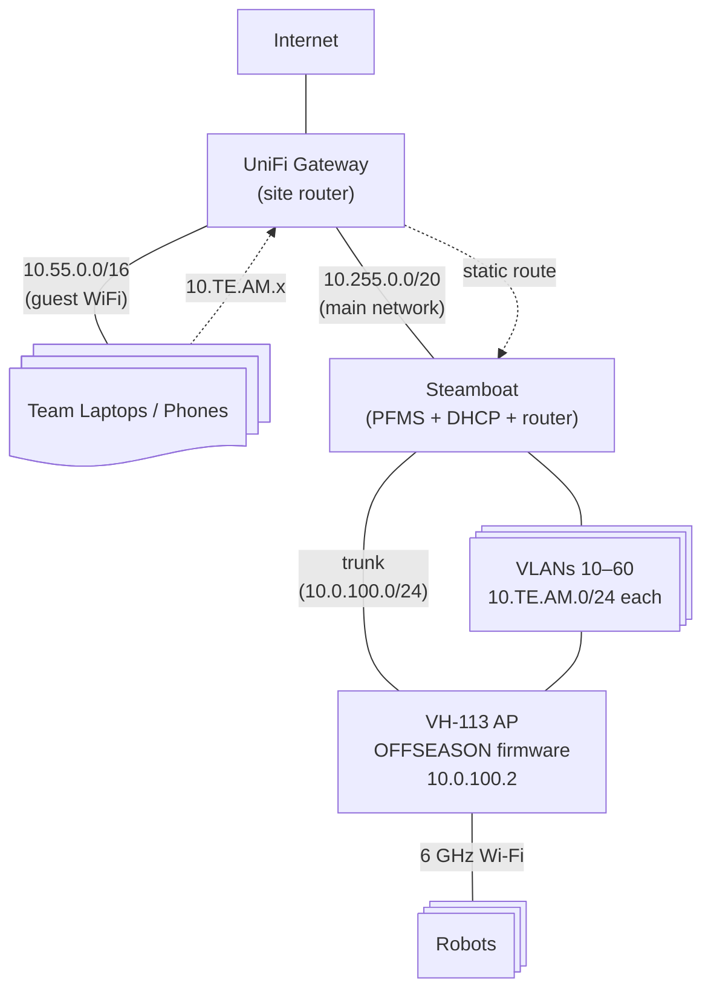

# Practice Field Configurator

A web interface for configuring practice field access points.

## Setup

1. Install system dependencies (Linux, for VLAN/DHCP management):

```bash
sudo apt install dnsmasq-base iputils-arping
```

`dnsmasq-base` provides the `dnsmasq` binary (without the system service) for per-VLAN DHCP.
`iputils-arping` provides `arping` for duplicate address detection before claiming team gateway IPs.

2. Install Node.js dependencies:

```bash
npm install
```

## Development

You'll need two terminal windows to run the development servers:

1. Start the backend API server:

```bash
npm run dev
```

2. In another terminal, start the frontend development server:

```bash
npm run dev -w frontend
```

The frontend will be available at http://localhost:5173.

The backend will be available at http://localhost:3000, however it is also proxied by the frontend dev server so no configuration should be necessary.

## Network Architecture

The VH-113 field radio runs **OFFSEASON** AP firmware (no DHCP, firewall between VLANs). Steamboat acts as the DHCP server and inter-VLAN router for all team subnets, and bridges team traffic to the site's guest WiFi so laptops can reach robots.



### Subnets

| Subnet        | CIDR            | Managed by    | Purpose                                                             |
| ------------- | --------------- | ------------- | ------------------------------------------------------------------- |
| Main network  | `10.255.0.0/20` | UniFi Gateway | Servers, infrastructure                                             |
| Guest WiFi    | `10.55.0.0/16`  | UniFi Gateway | Team laptops, phones (site-specific, conflicts with team 5500-5599) |
| Field control | `10.0.100.0/24` | UniFi/Static  | AP management, FMS                                                  |
| Team VLANs    | `10.TE.AM.0/24` | **Steamboat** | Per-team isolation (e.g. team 1234 → `10.12.34.0/24`)               |

### Radio Firmware: Why OFFSEASON

The VH-113 AP has three firmware variants:

| Mode          | DHCP                        | Firewall | Auth         | Use case                           |
| ------------- | --------------------------- | -------- | ------------ | ---------------------------------- |
| **PRACTICE**  | AP runs DHCP on VLANs 10-90 | Disabled | None         | Simple setup, no routing control   |
| **OFFSEASON** | None — external             | Enabled  | None         | Full control over DHCP and routing |
| **FRC**       | None — external             | Enabled  | Bearer token | Competition                        |

**PRACTICE** mode is simpler but the AP becomes the router for team subnets with no way to add routes to the site network. **OFFSEASON** mode lets Steamboat run DHCP and act as the gateway for each team VLAN, enabling routing between team subnets and the guest WiFi.

### Steamboat's Network Responsibilities

1. **VLAN interfaces** — trunk port carries VLANs 10-60 + 100; OS creates sub-interfaces (e.g. `eth0.10`, `eth0.20`)
2. **DHCP** — serves `10.TE.AM.100-199` on each active team's VLAN via `dnsmasq`, gateway = Steamboat (`10.TE.AM.4`)
3. **Inter-VLAN routing** — IP forwarding between team subnets and the guest WiFi subnet
4. **Radio configuration** — HTTP REST to `10.0.100.2` (already working)
5. **Syslog / FMS** — optional services for field telemetry

### Routing: Guest WiFi ↔ Team Subnets

For laptops on guest WiFi (`10.55.0.x`) to reach robots on team subnets (`10.TE.AM.x`):

1. **UniFi Gateway** needs a static route: `10.0.0.0/8` → Steamboat's main IP (one-time config, team-agnostic)
2. **Steamboat** has direct access to team VLANs via trunk and routes between them and its main interface
3. **Teams** use hardcoded IPs (e.g. `10.12.34.2` for roboRIO) — no DNS needed

See [TECHNICAL.md](TECHNICAL.md) for details on the startup sequence, configuration flow, and dry-run mode.

## Project Structure

- `src/` - Backend TypeScript files
- `frontend/` - React frontend application
- `dist/` - Compiled backend JavaScript files (generated after build)
- `tsconfig.json` - TypeScript configuration
- `package.json` - Project dependencies and scripts

## Deployment

To deploy this in a production environment:

1. Run `npm run build`

- Backend will be compiled to JavaScript and placed in the `dist/` folder
- Frontend will be built and placed in the `frontend/dist/` folder

2. Run `npm start`

- This will start the backend server using the compiled JavaScript files in `dist/`
- Alternative, you can run `node dist` directly to start the backend server, or copy the `dist/` folder to a different location and run it from there.

3. Configure Webserver to server static files and proxy to backend for websocket connections

- Alternatively, you can copy the `dist/` folder to a different location and serve it from there.

### Update Script

An update script is provided to update the backend and frontend dependencies. To run it, execute:

```bash
./update.sh
```

### Systemd Service

```service
[Unit]
Description=Practice Field Configurator Backend
After=network.target

[Service]
User=www-data
WorkingDirectory=/path/to/practice-field-configurator
ExecStart=/usr/bin/node dist
Restart=on-failure
Environment=WEBSOCKET_PORT=9001
Environment=TRUSTED_PROXIES=127.0.0.1,::1,10.0.0.0/8

[Install]
WantedBy=multi-user.target
```

### Caddy Example Config

```Caddyfile
practice.example.com {
    @stations {
        path_regexp ^/(red|blue)[123]$
    }

    reverse_proxy /ws localhost:9002

    # Prevent direct access to html files
    rewrite /index.html /non-existent-path
    rewrite /station.html /non-existent-path
    rewrite /admin.html /non-existent-path
    rewrite /logs.html /non-existent-path
    rewrite /network.html /non-existent-path

    rewrite @stations /station.html
    rewrite /admin /admin.html
    rewrite /logs /logs.html
    rewrite /network /network.html
    root /path/to/frontend/dist
    file_server
}
```

### Nginx Example Config

```conf
server {
    listen 80;
    server_name practice.example.com;
    root /path/to/frontend/dist;

    location ~^/(red|blue)[123]$ {
        rewrite ^ /station.html break;
    }

    location = /admin {
        rewrite ^ /admin.html break;
    }

    location = /logs {
        rewrite ^ /logs.html break;
    }

    location = /network {
        rewrite ^ /network.html break;
    }

    location /ws {
        proxy_pass http://localhost:3000;
        proxy_http_version 1.1;
        proxy_set_header Upgrade $http_upgrade;
        proxy_set_header Connection 'upgrade';
        proxy_set_header Host $host;
        proxy_cache_bypass $http_upgrade;
    }
}
```

## Environment Variables

- `WEBSOCKET_PORT`: Port for the WebSocket server (default: 3000)
- `RADIO_URL`: URL for the radio API (default: http://10.0.100.2)
- `VLAN_INTERFACE`: Physical network interface for VLAN configuration
- `FMS_ENDPOINT`: Set to 'true' to enable FMS server
- `SYSLOG_ENDPOINT`: Set to 'true' to enable syslog server
- `RADIO_CLEAR_SCHEDULE`: Cron expression for scheduled configuration clearing
- `RADIO_CLEAR_TIMEZONE`: Timezone for scheduled clearing
- `TRUSTED_PROXIES`: Comma-separated list of trusted proxy IPs/CIDR blocks for real client IP detection

### Trusted Proxies Configuration

When running behind a reverse proxy (like Caddy), set `TRUSTED_PROXIES` to enable real client IP detection:

```bash
# For Caddy running on localhost
TRUSTED_PROXIES=127.0.0.1,::1

# For Caddy on a specific network
TRUSTED_PROXIES=10.0.0.0/8

# Multiple proxies
TRUSTED_PROXIES=127.0.0.1,::1,10.0.0.0/8,192.168.1.0/24
```

This allows the application to read the `X-Forwarded-For` header from trusted proxies to log the real client IP instead of the proxy's IP (127.0.0.1).
