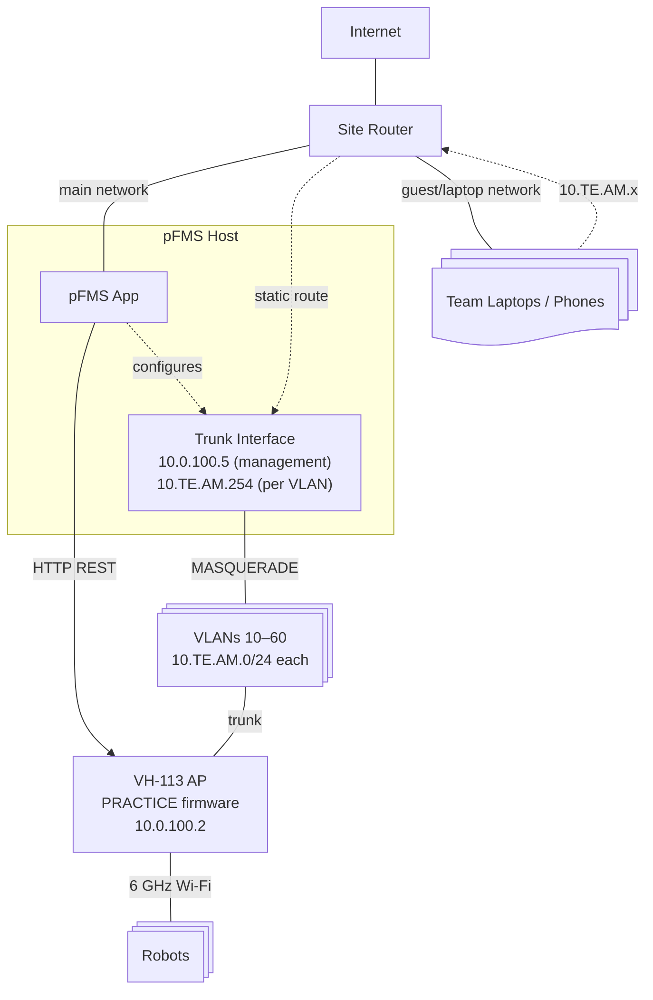

# Practice Field Management System

A web interface for configuring practice field access points and enabling team laptop ↔ robot routing.

## Setup

Works with [`PRACTICE` or `OFFSEASON` firmware](https://frc-radio.vivid-hosting.net/access-points/fms-ap-firmware-releases) on the VH-113 AP (or VH-109).
`PRACTICE` recommended for simplicity and programmer connectivity.

Currently, only Linux is supported due to dependencies on `iptables` and `iputils-arping` for VLAN and routing management.
The app must be run with root privileges to manage VLAN interfaces and routing rules.
Future versions may support other platforms.

1. Install system dependencies (Linux, for VLAN/routing):

```bash
sudo apt install fping iptables iputils-arping
```

- `fping` provides fast parallel pinging for the subnet scanner (device discovery on team VLANs).
- `iptables` is required for MASQUERADE rules that enable site network ↔ robot routing.
- `iputils-arping` provides `arping` for duplicate address detection (used in OFFSEASON firmware mode only).

> **OFFSEASON firmware only:** also install `dnsmasq-base` for per-VLAN DHCP serving.

2. Install Node.js dependencies:

```bash
npm install
```

## Development

You'll need two terminal windows to run the development servers:

1. Start the backend API server:

```bash
npm run dev
```

2. In another terminal, start the frontend development server:

```bash
npm run dev -w frontend
```

The frontend will be available at http://localhost:5173.

The backend will be available at http://localhost:3000, however it is also proxied by the frontend dev server so no configuration should be necessary.

## Network Architecture

The VH-113 field radio runs **`PRACTICE`** (or `OFFSEASON`) AP firmware. The AP handles DHCP on team VLANs directly; the pFMS host adds VLAN interfaces and MASQUERADE rules to route traffic between team subnets and the site network so laptops can reach robots and internet.



### Subnets

| Subnet        | CIDR            | Managed by    | Purpose                                               |
| ------------- | --------------- | ------------- | ----------------------------------------------------- |
| Main network  | (site-specific) | Site router   | Servers, infrastructure                               |
| Guest WiFi    | (site-specific) | Site router   | Team laptops, phones                                  |
| Field control | `10.0.100.0/24` | Static        | AP management, FMS                                    |
| Team VLANs    | `10.TE.AM.0/24` | **AP (DHCP)** | Per-team isolation (e.g. team 1234 → `10.12.34.0/24`) |

### pFMS Host Network Responsibilities

1. **VLAN interfaces** — trunk port carries VLANs 10-60 + 100; OS creates sub-interfaces (e.g. `eth0.10`, `eth0.20`)
2. **VLAN IP** — assigns itself `10.TE.AM.254` (configurable via `VLAN_HOST_OCTET`) on each active team's VLAN as a routing anchor
3. **Inter-VLAN routing** — IP forwarding + MASQUERADE rules between team subnets and the site network
4. **Radio configuration** — HTTP REST to `10.0.100.2`
5. **Syslog / FMS** — optional services for field telemetry

> **OFFSEASON firmware:** the pFMS host also runs `dnsmasq` per VLAN to serve DHCP (gateway = `10.TE.AM.254`), since the AP does not.

### Routing: Guest WiFi ↔ Team Subnets

For laptops on the site's guest/laptop network to reach robots on team subnets (`10.TE.AM.x`):

1. **Site router** needs a static route: `10.0.0.0/8` → the pFMS host's main IP (one-time config, team-agnostic)
2. **pFMS host** has direct access to team VLANs via trunk and routes between them and its main interface
3. **Teams** use hardcoded IPs (e.g. `10.12.34.2` for roboRIO) — no DNS needed

### Device Discovery

The backend periodically scans each configured team's subnet using `fping`, pinging `.1–.253` every 10 seconds. Discovered devices (IPs that have responded at least once) are tracked with up/down status and first/last-seen timestamps, and broadcast to frontend clients. Results appear in the **Discovered Devices** section on the Network page and are cleared when station config is cleared.

See [TECHNICAL.md](TECHNICAL.md) for details on the startup sequence, configuration flow, and dry-run mode.

## Project Structure

- `src/` - Backend TypeScript files
- `frontend/` - React frontend application
- `dist/` - Compiled backend JavaScript files (generated after build)
- `tsconfig.json` - TypeScript configuration
- `package.json` - Project dependencies and scripts

## Deployment

To deploy this in a production environment:

1. Run `npm run build`

- Backend will be compiled to JavaScript and placed in the `dist/` folder
- Frontend will be built and placed in the `frontend/dist/` folder

2. Run `npm start`

- This will start the backend server using the compiled JavaScript files in `dist/`
- Alternative, you can run `node dist` directly to start the backend server, or copy the `dist/` folder to a different location and run it from there.

3. Configure Webserver to server static files and proxy to backend for websocket connections

- Alternatively, you can copy the `dist/` folder to a different location and serve it from there.

### Update Script

An update script is provided to update the backend and frontend dependencies. To run it, execute:

```bash
./update.sh
```

### Systemd Service

```service
[Unit]
Description=Practice Field Configurator Backend
After=network.target

[Service]
User=www-data
WorkingDirectory=/path/to/practice-field-configurator
ExecStart=/usr/bin/node dist
Restart=on-failure
Environment=WEBSOCKET_PORT=9001
Environment=TRUSTED_PROXIES=127.0.0.1,::1,10.0.0.0/8

[Install]
WantedBy=multi-user.target
```

### Caddy Example Config

```Caddyfile
practice.example.com {
    @stations {
        path_regexp ^/(red|blue)[123]$
    }

    reverse_proxy /ws localhost:9002

    # Prevent direct access to html files
    rewrite /index.html /non-existent-path
    rewrite /station.html /non-existent-path
    rewrite /admin.html /non-existent-path
    rewrite /logs.html /non-existent-path
    rewrite /network.html /non-existent-path

    rewrite @stations /station.html
    rewrite /admin /admin.html
    rewrite /logs /logs.html
    rewrite /network /network.html
    root /path/to/frontend/dist
    file_server
}
```

### Nginx Example Config

```conf
server {
    listen 80;
    server_name practice.example.com;
    root /path/to/frontend/dist;

    location ~^/(red|blue)[123]$ {
        rewrite ^ /station.html break;
    }

    location = /admin {
        rewrite ^ /admin.html break;
    }

    location = /logs {
        rewrite ^ /logs.html break;
    }

    location = /network {
        rewrite ^ /network.html break;
    }

    location /ws {
        proxy_pass http://localhost:3000;
        proxy_http_version 1.1;
        proxy_set_header Upgrade $http_upgrade;
        proxy_set_header Connection 'upgrade';
        proxy_set_header Host $host;
        proxy_cache_bypass $http_upgrade;
    }
}
```

## Environment Variables

- `WEBSOCKET_PORT`: Port for the WebSocket server (default: 3000)
- `RADIO_URL`: URL for the radio API (default: http://10.0.100.2)
- `VLAN_INTERFACE`: Physical network interface for VLAN configuration
- `FMS_ENDPOINT`: Set to 'true' to enable FMS server
- `SYSLOG_ENDPOINT`: Set to 'true' to enable syslog server
- `RADIO_CLEAR_SCHEDULE`: Cron expression for scheduled configuration clearing
- `RADIO_CLEAR_TIMEZONE`: Timezone for scheduled clearing
- `VLAN_HOST_OCTET`: Host octet for the pFMS host's IP on each team VLAN (default: `254`, range: `220–254`). E.g. `254` → pFMS host is `10.TE.AM.254`. Set lower to avoid conflicts with other devices on the subnet.
- `TRUSTED_PROXIES`: Comma-separated list of trusted proxy IPs/CIDR blocks for real client IP detection

### Trusted Proxies Configuration

When running behind a reverse proxy (like Caddy), set `TRUSTED_PROXIES` to enable real client IP detection:

```bash
# For Caddy running on localhost
TRUSTED_PROXIES=127.0.0.1,::1

# For Caddy on a specific network
TRUSTED_PROXIES=10.0.0.0/8

# Multiple proxies
TRUSTED_PROXIES=127.0.0.1,::1,10.0.0.0/8,192.168.1.0/24
```

This allows the application to read the `X-Forwarded-For` header from trusted proxies to log the real client IP instead of the proxy's IP (127.0.0.1).
