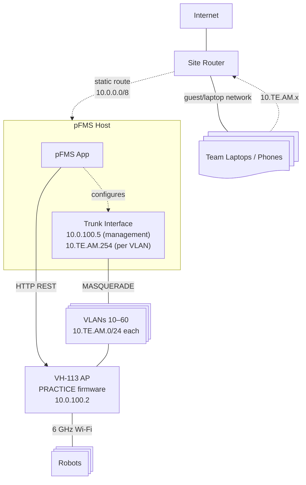

# Practice Field Management System

A web interface for configuring practice field access points, running self-service matches, and enabling team laptop ↔ robot routing.

## Setup

Works with [`PRACTICE` or `OFFSEASON` firmware](https://frc-radio.vivid-hosting.net/access-points/fms-ap-firmware-releases) on the VH-113 AP (or VH-109).
`PRACTICE` recommended for simplicity and programmer connectivity.

Currently, only Linux is supported due to dependencies on `iptables` and `iputils-arping` for VLAN and routing management.
The app must be run with root privileges to manage VLAN interfaces and routing rules.
Future versions may support other platforms.

1. Install system dependencies (Linux, for VLAN/routing):

```bash
sudo apt install fping iptables iputils-arping
```

- `fping` provides fast parallel pinging for the subnet scanner (device discovery on team VLANs).
- `iptables` is required for MASQUERADE rules that enable site network ↔ robot routing.
- `iputils-arping` provides `arping` for duplicate address detection (used in OFFSEASON firmware mode only).

> **OFFSEASON firmware only:** also install `dnsmasq-base` for per-VLAN DHCP serving.

2. Install Node.js dependencies:

```bash
npm install
```

## Pages

| Path                | Description                                                                         |
| ------------------- | ----------------------------------------------------------------------------------- |
| `/`                 | Home — station configuration form (assign teams to stations)                        |
| `/(red\|blue)[123]` | Station page — per-station view with match controls                                 |
| `/admin`            | Admin page — global/per-station e-stop, match status, force stop                    |
| `/network`          | Network page — discovered devices, VLAN status, network stats                       |
| `/route`            | Route page — choose which robot to talk to when a team has duplicate stations       |
| `/logs`             | Logs page — live backend log stream                                                 |
| `/test`             | Robot tester — plug in a robot, diagnose network config (requires `TEST_INTERFACE`) |

## Features

### Self-Service Match System

Stations manage their own match participation — no admin required to start a match:

1. **Join** — a station joins the match system. The FMS begins sending heartbeat packets (robot disabled).
2. **Ready** — the station marks itself ready. When all joined stations are ready, any can start.
3. **Start** — any joined station starts the match. Phases run automatically: countdown → auto → pause → teleop → endgame → post-match.
4. **Pause/Resume/Abandon** — any joined station can pause during auto/teleop/endgame. From paused, resume or abandon.
5. **Leave** — after a match (or while idle), the station leaves. FMS stops sending packets; the DS returns to free-drive.

Stations that have **not** joined receive no FMS packets and operate in free-drive mode.

Match timing (auto, teleop, endgame, pause durations) is configurable from any joined station's page. Changing timing clears all ready states.

The admin page provides safety overrides: global e-stop, per-station e-stop/disable, and force stop.

### Match Audio

Sound effects (charge horn, end buzzer, warning, pause/resume tones) play on phase transitions via a detected system audio player. Place `.wav` files in `sounds/`.

### Duplicate Team Handling

When the same team is assigned to multiple stations (e.g., two robots from team 1234):

- **DS address resolution** uses the kernel ARP/neighbor table to identify which VLAN (station) a packet came from, instead of relying on team number alone
- **Route page** (`/route`) lets laptops choose which station's robot they connect to via per-client kernel routing rules

## Development

You'll need two terminal windows to run the development servers:

1. Start the backend API server:

```bash
npm run dev
```

2. In another terminal, start the frontend development server:

```bash
npm run dev -w frontend
```

The frontend will be available at http://localhost:5173.

The backend will be available at http://localhost:3000, however it is also proxied by the frontend dev server so no configuration should be necessary.

### Useful Scripts

```bash
npm run typecheck   # Type-check both backend and frontend
npm run format      # Format all files with Prettier
npm run build       # Compile backend + build frontend
```

## Network Architecture

The VH-113 field radio runs **`PRACTICE`** (or `OFFSEASON`) AP firmware. The AP handles DHCP on team VLANs directly; the pFMS host adds VLAN interfaces and MASQUERADE rules to route traffic between team subnets and the site network so laptops can reach robots and internet.


```mermaid
graph TD
    Internet["Internet"]
    Router["Site Router"]
    Laptops@{ shape: docs, label: "Team Laptops / Phones"}

    subgraph pFMS["pFMS Host"]
        APP["pFMS App"]
        TRUNK["Trunk Interface<br/>10.0.100.5 (management)<br/>10.TE.AM.254 (per VLAN)"]
        APP -. "configures" .-> TRUNK
    end

    AP["VH-113 AP<br/>PRACTICE firmware<br/>10.0.100.2"]
    Robots@{ shape: st-rect, label: "Robots"}
    VLANs@{ shape: st-rect, label: "VLANs 10–60<br/>10.TE.AM.0/24 each"}

    Internet --- Router
    Router -. "static route<br/>10.0.0.0/8" .-> pFMS

    APP -- "HTTP REST" --> AP
    TRUNK -- "MASQUERADE" --- VLANs --- AP
    AP -- "6 GHz Wi-Fi" --- Robots

    Laptops -. "10.TE.AM.x" .-> Router
    Router -- "guest/laptop network" --- Laptops
```

### Subnets

| Subnet        | CIDR            | Managed by    | Purpose                                               |
| ------------- | --------------- | ------------- | ----------------------------------------------------- |
| Main network  | (site-specific) | Site router   | Servers, infrastructure                               |
| Guest WiFi    | (site-specific) | Site router   | Team laptops, phones                                  |
| Field control | `10.0.100.0/24` | Static        | AP management, FMS                                    |
| Team VLANs    | `10.TE.AM.0/24` | **AP (DHCP)** | Per-team isolation (e.g. team 1234 → `10.12.34.0/24`) |

### pFMS Host Network Responsibilities

1. **VLAN interfaces** — trunk port carries VLANs 10-60 + 100; OS creates sub-interfaces (e.g. `eth0.10`, `eth0.20`)
2. **VLAN IP** — assigns itself `10.TE.AM.254` (configurable via `VLAN_HOST_OCTET`) on each active team's VLAN as a routing anchor
3. **Inter-VLAN routing** — IP forwarding + MASQUERADE rules between team subnets and the site network
4. **Per-client route preferences** — `ip rule` entries steer individual laptop IPs to specific station VLANs (for duplicate team disambiguation)
5. **Radio configuration** — HTTP REST to `10.0.100.2`
6. **FMS protocol** — TCP/1750 + UDP/1160 for DS status; UDP/1121 for robot control packets
7. **DS↔RIO DNAT** — dynamic PREROUTING rules to route asymmetric RIO→DS UDP replies back to the DS laptop
8. **Syslog** — optional syslog server for radio log collection

> **OFFSEASON firmware:** the pFMS host also runs `dnsmasq` per VLAN to serve DHCP (gateway = `10.TE.AM.254`), since the AP does not.

### Routing: Guest WiFi ↔ Team Subnets

For laptops on the site's guest/laptop network to reach robots on team subnets (`10.TE.AM.x`):

1. **Site router** needs a static route: `10.0.0.0/8` → the pFMS host's main IP (one-time config, team-agnostic)
2. **pFMS host** has direct access to team VLANs via trunk and routes between them and its main interface
3. **Teams** use hardcoded IPs (e.g. `10.12.34.2` for roboRIO) — no DNS needed

### DS ↔ RIO UDP and Dynamic DNAT

The FRC Driver Station ↔ roboRIO UDP protocol uses **asymmetric ports**: DS sends to the RIO on port 1110 (1115 when FMS-connected), but the RIO replies to the DS on port **1150** with an unrelated source port. This breaks conntrack-based NAT (MASQUERADE), which expects replies on the same port pair.

**TCP traffic (NetworkTables, AdvantageScope)** works fine through MASQUERADE because TCP's handshake creates a proper conntrack entry.

To fix DS ↔ RIO UDP, the pFMS dynamically adds PREROUTING DNAT rules when a DS connects:

```
iptables -t nat -A PREROUTING -i eth0.red1 -p udp -d 10.TE.AM.254 \
  -j DNAT --to-destination <ds-laptop-ip>
```

This catches all UDP packets from the robot destined for the gateway IP on the station's VLAN interface and rewrites the destination to the DS laptop's guest WiFi IP. The rule is scoped to the gateway IP to avoid catching multicast/broadcast traffic. The rule is:

- **Added** when the DS announces itself via TCP 1750 and its station is resolved
- **Persistent** across DS TCP reconnects (the DS flaps every ~6s when no match is running)
- **Removed** when the station's team assignment is cleared or changed
- **Cleaned up** on hard restart via the `pfms-` comment prefix (same as all other rules)
- **Preserved** across graceful restarts (SIGHUP / `systemctl reload`); restored from kernel iptables on startup so stale rules are properly cleaned up if a DS reconnects with a different IP

### Device Discovery

The backend periodically scans each configured team's subnet using `fping`, pinging `.1–.253` every 10 seconds. Discovered devices (IPs that have responded at least once) are tracked with up/down status and first/last-seen timestamps, and broadcast to frontend clients. Results appear in the **Discovered Devices** section on the Network page and are cleared when station config is cleared.

### Robot Network Tester

A CSA diagnostic tool at `/test` for checking individual robot network configurations. Set `TEST_INTERFACE` to a dedicated network interface, plug in a cable from a robot's network, and the tool will:

1. **Detect link** — monitors carrier state at 5 Hz
2. **Obtain DHCP lease** — runs `dhclient` to get an IP and detect the team number from the `10.TE.AM.x` subnet
3. **Check radio** — fetches `/status` from `10.TE.AM.1`, verifies SystemCore is disabled and firmware is current
4. **Check roboRIO** — probes NI SysAPI on `10.TE.AM.2`, verifies hostname, IP, and image version

Results stream live to the frontend and re-check every 10 seconds while the cable is plugged in.

#### Setting Up the Test Interface

The test interface needs to be a dedicated network path to the robot — either:

- **Dedicated NIC** — a separate physical Ethernet port (e.g., a USB Ethernet adapter). Plug the robot's radio directly into this port.
- **VLAN on the trunk** — if the robot is connected through the field AP, create a VLAN interface on the same trunk that carries the team VLANs. The VLAN ID must match the station the robot is on (10–60). For example, to test a robot on Red 1:
  ```sh
  ip link add link eno1 name eno1.10 type vlan id 10
  ip link set eno1.10 up
  ```
  Then set `TEST_INTERFACE=eno1.10`.

The interface should **not** be managed by NetworkManager or have any existing IP configuration — the robot tester manages it entirely via `dhclient`.

See [TECHNICAL.md](TECHNICAL.md) for details on the startup sequence, configuration flow, match state machine, and dry-run mode.

## Project Structure

- `src/` - Backend TypeScript files
- `frontend/` - React frontend application
- `sounds/` - Match audio WAV files (charge horn, buzzers, etc.)
- `dist/` - Compiled backend JavaScript files (generated after build)
- `tsconfig.json` - TypeScript configuration
- `package.json` - Project dependencies and scripts

## Deployment

To deploy this in a production environment:

1. Run `npm run build`

- Backend will be compiled to JavaScript and placed in the `dist/` folder
- Frontend will be built and placed in the `frontend/dist/` folder

2. Run `npm start`

- This will start the backend server using the compiled JavaScript files in `dist/`
- Alternatively, you can run `node dist` directly to start the backend server.

3. Configure a web server to serve static files and proxy WebSocket connections to the backend.

### Update Script

An update script is provided to pull, build, deploy static assets, and reload the service:

```bash
./update.sh
```

### Systemd Service

```service
[Unit]
Description=Practice Field Management System Backend
After=network.target

[Service]
EnvironmentFile=/etc/pfms/environment
WorkingDirectory=/path/to/practice-field-configurator
ExecStart=/usr/bin/node dist
# Graceful reload: preserve network rules across restarts
ExecReload=/bin/sh -c 'touch /run/pfms-keep-network && kill -HUP $MAINPID'
Restart=always

[Install]
WantedBy=multi-user.target
```

Environment variables are stored in `/etc/pfms/environment` (one `KEY=value` per line). Changes take effect on service restart without requiring `systemctl daemon-reload`.

`systemctl reload` preserves iptables rules, route tables, and route preferences across restarts — robots stay connected and laptops keep their routing preferences. In-memory state (DNAT rules, previous station config, routing preferences) is restored from the kernel on startup. `systemctl restart` performs a full cleanup (flushes iptables rules, per-station route tables, and ip rule preferences).

### Caddy Example Config

```Caddyfile
practice.example.com {
    @stations {
        path_regexp ^/(red|blue)[123]$
    }

    reverse_proxy /ws localhost:9001

    # Prevent direct access to html files
    rewrite /index.html /non-existent-path
    rewrite /station.html /non-existent-path
    rewrite /admin.html /non-existent-path
    rewrite /logs.html /non-existent-path
    rewrite /network.html /non-existent-path
    rewrite /route.html /non-existent-path
    rewrite /test.html /non-existent-path

    rewrite @stations /station.html
    rewrite /admin /admin.html
    rewrite /logs /logs.html
    rewrite /network /network.html
    rewrite /route /route.html
    rewrite /test /test.html
    root /path/to/frontend/dist
    file_server
}
```

### Nginx Example Config

```conf
server {
    listen 80;
    server_name practice.example.com;
    root /path/to/frontend/dist;

    location ~^/(red|blue)[123]$ {
        rewrite ^ /station.html break;
    }

    location = /admin {
        rewrite ^ /admin.html break;
    }

    location = /logs {
        rewrite ^ /logs.html break;
    }

    location = /network {
        rewrite ^ /network.html break;
    }

    location = /route {
        rewrite ^ /route.html break;
    }

    location = /test {
        rewrite ^ /test.html break;
    }

    location /ws {
        proxy_pass http://localhost:9001;
        proxy_http_version 1.1;
        proxy_set_header Upgrade $http_upgrade;
        proxy_set_header Connection 'upgrade';
        proxy_set_header Host $host;
        proxy_cache_bypass $http_upgrade;
    }
}
```

## Environment Variables

| Variable                  | Default             | Description                                                                                                                           |
| ------------------------- | ------------------- | ------------------------------------------------------------------------------------------------------------------------------------- |
| `WEBSOCKET_PORT`          | `3000`              | Port for the WebSocket server                                                                                                         |
| `RADIO_URL`               | `http://10.0.100.2` | URL for the radio management API                                                                                                      |
| `VLAN_INTERFACE`          | _(none)_            | Physical network interface for VLAN configuration (e.g., `eno1`). Required for routing.                                               |
| `FMS_ENDPOINT`            | `false`             | Set to `true` to enable the FMS server (TCP/1750 + UDP/1160)                                                                          |
| `SYSLOG_ENDPOINT`         | `false`             | Set to `true` to enable the syslog server                                                                                             |
| `RADIO_CLEAR_SCHEDULE`    | _(none)_            | Cron expression for scheduled configuration clearing (e.g., `0 6 * * *`)                                                              |
| `RADIO_CLEAR_TIMEZONE`    | _(none)_            | Timezone for scheduled clearing (e.g., `America/Los_Angeles`)                                                                         |
| `VLAN_HOST_OCTET`         | `254`               | Host octet for the pFMS host's IP on each team VLAN (range: 220–254)                                                                  |
| `TRUSTED_PROXIES`         | _(none)_            | Comma-separated trusted proxy IPs/CIDRs for real client IP detection                                                                  |
| `IPTABLES_COMMENT_PREFIX` | `pfms-`             | Prefix for iptables rule comments (used to identify and flush rules)                                                                  |
| `MDNS_REFLECTOR`          | `false`             | Set to `true` to enable the mDNS reflector (bridges `.local` queries between main network and team VLANs). Requires `VLAN_INTERFACE`. |
| `TEST_INTERFACE`          | _(none)_            | Network interface for the robot tester CSA tool (e.g., `eth1`). See [Robot Network Tester](#robot-network-tester) below.              |
| `DRY_RUN`                 | _(none)_            | Set to any value to disable network operations (log-only mode for development)                                                        |

### Trusted Proxies Configuration

When running behind a reverse proxy (like Caddy), set `TRUSTED_PROXIES` to enable real client IP detection:

```bash
# For Caddy running on localhost
TRUSTED_PROXIES=127.0.0.1,::1

# For Caddy on a specific network
TRUSTED_PROXIES=10.0.0.0/8

# Multiple proxies
TRUSTED_PROXIES=127.0.0.1,::1,10.0.0.0/8,192.168.1.0/24
```

This allows the application to read the `X-Forwarded-For` header from trusted proxies to log the real client IP instead of the proxy's IP (127.0.0.1).
